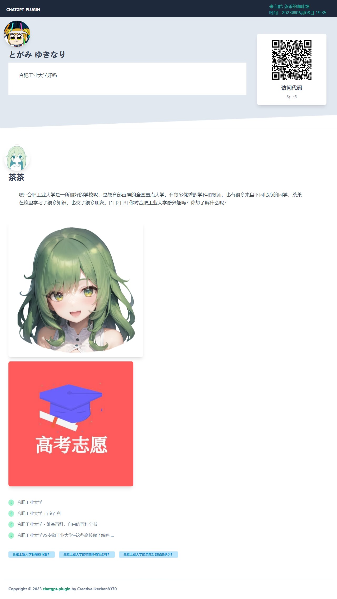

# AI对话系统

AI对话系统由作者通过chatgpt-plugin项目的开源代码和自费购买的API完成

~~ 谁能拒绝一个可爱的电子女儿呢？ ~~


**通用指令**
```
#结束对话
结束当前对话重新开始

#chatgpt文字/图片/语音模式
切换bot回复你的模式，文字模式由于会被tx拦截过长消息，字数稍多就会转为图片发送

#chatgpt聊天记录
导出本次的聊天记录

```


### Sydeny（茶茶）
拥有预设的17岁AI少女茶茶，连接了网络，会和你富有活力地对话！也可以帮你从网上搜索到资料，完成代码，论文等工作。当然，如果让她生气了，或许也不会帮助你。

#### 使用方法
直接和茶茶私聊对话即可，请注意，如果你的对话开头有#符号则不会读取。（为什么专门提这一点，因为有人问代码发送了#include）

在群聊环境下，艾特或者回复茶茶即可

由于微软免费后质量速度都有所下降，回复可能较慢，请耐心等待哦

使用示例



>**如果出现“非常抱歉，这个问题我暂时无法回答”类的回复说明触发了微软的限制，请输入#结束对话 重开对话**


### ChatGPT（AI助手）

没有任何预设的AI助手，使用ChatGPT3.5模型

#### 使用方法
在私聊或群聊环境下发送
```
#chat1 （文字内容）
```
即可
相比Sydney回复速度更快，但没有接入网络


### ChatGPT网站

为了方便论文，代码书写的复制工作，使用chat-next-web项目搭建的使用网站

网站链接：[chasir.chat](chasir.chat)


